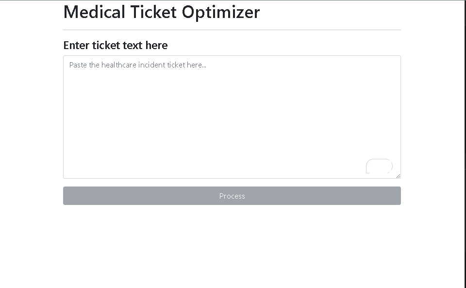
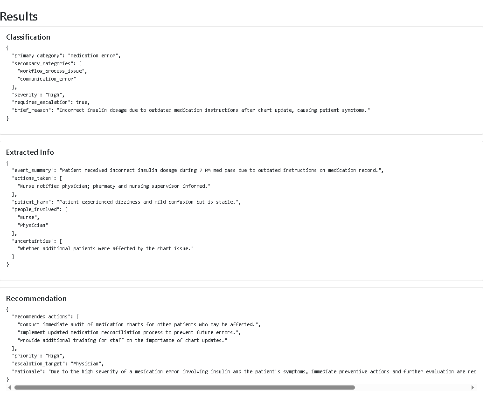

# MedTicketOptimizer

AI-powered healthcare incident triage agent that classifies reports, extracts operational details, and recommends next-step actions.

## Why I built this 
Healthcare incident reports are often inconsistent, difficult to triage, and time-sensitive. MedTicketOptimizer explores how AI agents can structure noisy operational reports and assist healthcare staff with faster, more standardized responses. 

## Simple Operation
One just has to enter the raw text of the incident report in the window labelled "". Then Click the button labelled "Process"

## Agent Pipeline
The main processing agent passes the report through a chain of agents:

→ Main Agent that extracts the raw incident ticket
→ Classification Agent
→ Extraction Agent
→ Recommendation Agent
→ Back to the main agent that displays structured operational output

1) Classification Agent - initial triage - assigns pre-determined primary and secondary classification, severity level and determines the escalation. 

2) Extraction agent  -  summarizes necessary infomation including, patient harm, actions taken and people involved. 

3) Recommendation agent - recommends the next steps based on the above assessment and  assigns an operational priority. 

## Screenshots

### Blank Application

### Processed Incident Report

## Tech Stack

- Python
- FastAPI
- React + Vite
- OpenAI Responses API
- Structured Outputs / JSON Schema
- Pydantic
- Bootstrap

## Architecture

## How to run it 

- Download the git repository

    `git clone https://github.com/saclearn75/MedTicketOptimizer.git`

- create an API Key for the OpenAI SDK - 
    * Website - https://platform.openai.com/api-keys; Create an account and a secret key. 
    * create a file called `.env` in the `<locally-cloned-repo>\backend` folder 
    * Add the line `OPENAI_KEY=<The-key-you-just-created>` and save and close the file (so you dont accidentally edit it)

- Backend 
    * create a python and start virtual environment* in the `backend` folder, run `python -m venv venv` 
    * run `.\venv\Scripts\activate` to start the virtual environment
    * download the backend dependencies - run `pip install -r requirements.txt`
    * start the backend run `uvicorn main:app --reload`

- Frontend
    * navigate to `<locally-cloned-repo>\frontend` folder on the command prompt CLI. 
    * run `npm install`. This reads the `package.json` file, downloads dependencies and creates the node_modules folder. 
    * run `npm start` or `npm run dev` to start the vite server. The server will be listening, usually, at `http:\\localhost:5173`
    * open the `http:\\localhost:5173` in your browser

## Future Improvements

- Retrieval-Augmented Generation (RAG)
- Long-term incident memory
- Similar incident retrieval
- GraphRAG exploration
- Clinical workflow integrations
- Role-based escalation logic